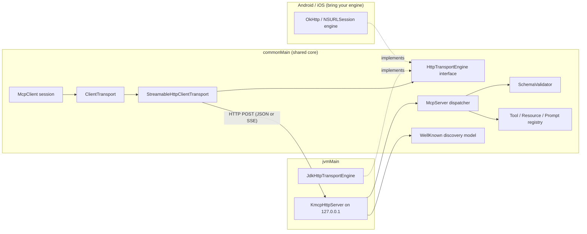

# kmcp

[English](README.md) | [中文](README.zh.md) | [日本語](README.ja.md)

 [](LICENSE) [](CHANGELOG.md) [](https://kotlinlang.org) [](https://github.com/JaydenCJ/kmcp/issues)

**Kotlin Multiplatform 向けのオープンソース MCP client/server SDK。プロトコルコアは `commonMain` に 1 つ、JVM 上で検証済みです。**


```bash
git clone https://github.com/JaydenCJ/kmcp.git && cd kmcp && ./gradlew publishToMavenLocal
```

## なぜ kmcp なのか

MCP は agent とアプリケーションをつなぐ事実上の相互運用レイヤーになりましたが、一級の SDK は TypeScript と Python のみで、Kotlin・Android 開発者は JSON-RPC を手書きでつなぐしかありませんでした。kmcp は現行世代の MCP を `commonMain` にネイティブ実装しています。ステートレスな Streamable HTTP transport、プロトコルバージョンのネゴシエーション、JSON Schema 検証つきのツール登録 DSL、そして `/.well-known/mcp` ディスカバリドキュメントのモデル（ドラフト段階の慣行です。「特徴」を参照）です。プロトコルコアはプラットフォーム中立の Kotlin で、現時点でビルド・テスト済みのパスは JVM アーティファクトです（Android アプリも同じものを利用します）。宣言済みの iOS ターゲットは macOS ホストでのコンパイルが必要です。

|  | kmcp | Official SDKs (TypeScript / Python) | koog |
|---|---|---|---|
| スコープ | MCP protocol SDK (client + server) | MCP protocol SDK (client + server) | Agent framework built on top of MCP |
| Kotlin Multiplatform | JVM (built + tested); iOS targets declared, not yet compiled; Android via the JVM artifact | no (TypeScript / Python runtimes) | Kotlin, JVM-first |
| ステートレス Streamable HTTP client transport | yes, in `commonMain` | yes | consumes MCP through clients |
| `.well-known/mcp` ディスカバリモデル（ドラフト慣行） | draft model + parser + served by the JVM host | no built-in model | no |
| ツール入力の検証 | JSON Schema subset validator built in | via zod / pydantic | delegated to the protocol layer |

## 特徴

- **プロトコルコアは `commonMain` に 1 つ** — JSON-RPC 2.0 モデル、initialize ハンドシェイク、tools/resources/prompts はプラットフォーム中立の Kotlin で、全ターゲットが同じ実装を共有します。ただし検証状況には差があります。JVM ターゲットはビルド・テスト済み、宣言済みの iOS ターゲットは macOS ホストでしかコンパイルできず未ビルド、Android は JVM アーティファクトを利用します。
- **ステートレス設計** — MCP のステートレス Streamable HTTP 世代に合わせた設計です。各リクエストが自己完結し、サーバーはセッション親和性なしで水平スケールできます。
- **検証つきツール DSL** — 型付き DSL で入力を一度宣言するだけで JSON Schema が生成され、不正な呼び出しは handler の手前で `-32602` エラーとして拒否されます。
- **ディスカバリ内蔵（ドラフト）** — `.well-known/mcp` ドキュメントのモデルとパーサーを備え、同梱の JVM host が自動で配信します。このドキュメント形状はエコシステムで流通しているディスカバリのドラフトに沿ったもので、公開済みの MCP 仕様の一部ではなく、今後変わる可能性があります。
- **差し替え可能な HTTP エンジン** — JVM には `java.net.http` エンジンを同梱。Android は OkHttp、iOS は NSURLSession で、小さなインターフェースを 1 つ実装するだけです。
- **依存ゼロの JVM server host** — `com.sun.net.httpserver` ベースで MCP エンドポイントを組み込めます。デフォルトで `127.0.0.1` のみにバインドします。

## クイックスタート

1. ビルドしてローカル Maven リポジトリにインストールします:

```bash
git clone https://github.com/JaydenCJ/kmcp.git && cd kmcp && ./gradlew publishToMavenLocal
```

2. プロジェクトに依存を追加します:

```kotlin
repositories { mavenLocal(); mavenCentral() }
dependencies { implementation("dev.kmcp:kmcp:0.1.0") }
```

3. server を定義し、client をつなぎ、ツールを呼び出します。このコードは `ReadmeExampleTest` がそのままカバーしています:

```kotlin
val server = mcpServer(name = "echo", version = "0.1.0") {
    tool("echo", description = "Echo text back") {
        input { string("text", description = "Text to echo") }
        handle { args -> toolText("echo: " + args.string("text")) }
    }
}
val client = McpClient(InMemoryTransport(server), Implementation("demo", "0.1.0"))
client.initialize()
val result = client.callTool("echo", buildJsonObject { put("text", "hi") })
println(result.text()) // echo: hi
```

出力:

```text
echo: hi
```

4. 同じツールを実際の HTTP で公開します（`./gradlew runEchoServer` を実行し、別のターミナルから）:

```bash
curl -s http://127.0.0.1:8931/mcp -H 'content-type: application/json' \
  -d '{"jsonrpc":"2.0","id":1,"method":"tools/call","params":{"name":"echo","arguments":{"text":"hello kmcp"}}}'
```

出力:

```text
{"jsonrpc":"2.0","id":1,"result":{"content":[{"type":"text","text":"echo: hello kmcp"}]}}
```

5. Claude Code（または任意の MCP client）から接続します — `.mcp.json`:

```json
{
  "mcpServers": {
    "kmcp-echo": {
      "type": "http",
      "url": "http://127.0.0.1:8931/mcp"
    }
  }
}
```

## アーキテクチャ



[`samples/android-capabilities/`](samples/android-capabilities/) の Android リファレンスサンプルは、デバイスの機能（連絡先・カレンダー・通知）を権限確認つきの MCP tools として公開する方法を示しています。ソースコードのみの提供で、詳細は同ディレクトリの README を参照してください。

## 開発

JDK 11+ があれば Linux・macOS・Windows で全部の検証を実行できます（テストは JVM target 上で動きます）:

```bash
./gradlew jvmTest      # unit + integration tests (77 tests)
bash scripts/smoke.sh  # offline MCP protocol round-trip smoke test
./gradlew build        # full build; Apple targets are skipped automatically on non-macOS hosts
```

直近のローカル実行では `./gradlew jvmTest` が 77 件 `PASSED`・0 件 `FAILED`、`bash scripts/smoke.sh` は `SMOKE OK` で終了します。

## ロードマップ

- [x] `commonMain` の MCP コア: JSON-RPC 2.0 モデル、バージョンネゴシエーションつき initialize ハンドシェイク、tools/resources/prompts、ステートレス Streamable HTTP client transport、JSON Schema 検証、`.well-known/mcp` ディスカバリモデル
- [ ] JVM server host での SSE ストリーミングレスポンス
- [ ] OkHttp（Android）と NSURLSession（iOS）のエンジンアーティファクト
- [ ] ローカルプロセス server 向けの stdio transport
- [ ] Maven Central への公開

全体は [open issues](https://github.com/JaydenCJ/kmcp/issues) を参照してください。

## コントリビューション

コントリビューションを歓迎します。まずは [good first issue](https://github.com/JaydenCJ/kmcp/issues?q=is%3Aissue+is%3Aopen+label%3A%22good+first+issue%22) から、または [Issues](https://github.com/JaydenCJ/kmcp/issues) でお気軽にどうぞ。[CONTRIBUTING.md](CONTRIBUTING.md) も参照してください。

## ライセンス

[MIT](LICENSE)
