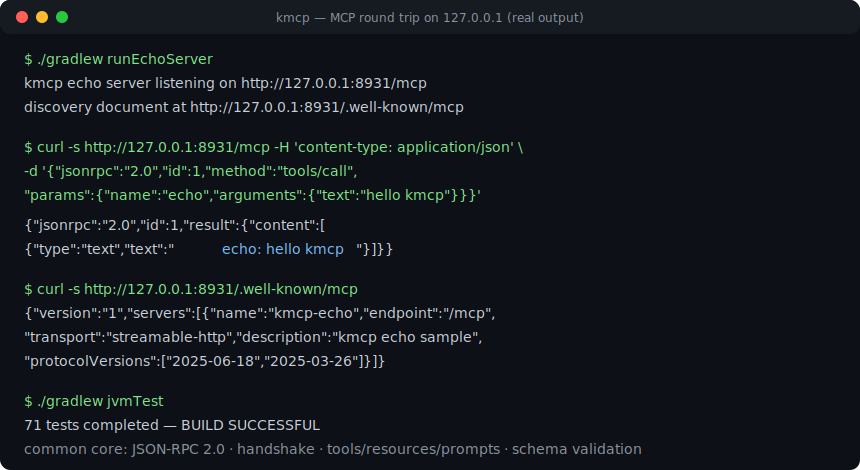
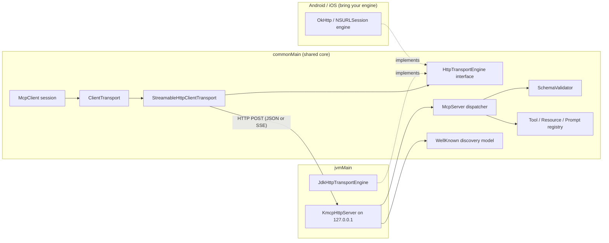

# kmcp

[English](README.md) | [中文](README.zh.md) | [日本語](README.ja.md)

 [](LICENSE) [](CHANGELOG.md) [](https://kotlinlang.org) [](https://github.com/JaydenCJ/kmcp/issues)

**An open-source MCP client/server SDK for Kotlin Multiplatform — one protocol core in `commonMain`, verified on the JVM.**



```bash
git clone https://github.com/JaydenCJ/kmcp.git && cd kmcp && ./gradlew publishToMavenLocal
```

## Why kmcp?

MCP has become the default interoperability layer between agents and applications, but the first-class SDKs cover TypeScript and Python — Kotlin and Android developers end up gluing JSON-RPC together by hand. kmcp implements the current MCP generation natively in `commonMain`: the stateless Streamable HTTP transport, protocol version negotiation, a tool registration DSL with JSON Schema validation, and a `/.well-known/mcp` discovery document model (a draft convention, see Features). The protocol core is platform-neutral Kotlin; today the JVM artifact is the built-and-tested path — Android apps consume it too — while the declared iOS targets still await compilation on a macOS host.

|  | kmcp | Official SDKs (TypeScript / Python) | koog |
|---|---|---|---|
| Scope | MCP protocol SDK (client + server) | MCP protocol SDK (client + server) | Agent framework built on top of MCP |
| Kotlin Multiplatform | JVM (built + tested); iOS targets declared, not yet compiled; Android via the JVM artifact | no (TypeScript / Python runtimes) | Kotlin, JVM-first |
| Stateless Streamable HTTP client transport | yes, in `commonMain` | yes | consumes MCP through clients |
| `.well-known/mcp` discovery model (draft convention) | draft model + parser + served by the JVM host | no built-in model | no |
| Tool input validation | JSON Schema subset validator built in | via zod / pydantic | delegated to the protocol layer |

## Features

- **One protocol core in `commonMain`** — the JSON-RPC 2.0 model, the initialize handshake, and tools/resources/prompts are platform-neutral Kotlin shared by every target. Verification is uneven today: the JVM target is built and tested locally, the declared iOS targets compile only on macOS hosts and have not been built yet, and Android consumes the JVM artifact.
- **Stateless by design** — built for the stateless Streamable HTTP generation of MCP: every request is a self-contained exchange, so servers scale horizontally with no session affinity.
- **Tool DSL with built-in validation** — declare inputs once in a typed DSL; kmcp generates the JSON Schema and rejects invalid calls with error `-32602` before your handler runs.
- **Discovery included (draft)** — a `.well-known/mcp` document model and parser, served automatically by the bundled JVM host. The document shape follows discovery drafts circulating in the ecosystem; it is not part of the published MCP specification and may change.
- **Pluggable HTTP engines** — a `java.net.http` engine ships for the JVM; an OkHttp (Android) or NSURLSession (iOS) engine is one small interface away.
- **Zero-dependency JVM server host** — embed an MCP endpoint with `com.sun.net.httpserver`, bound to `127.0.0.1` by default.

## Quickstart

1. Build and install to your local Maven repository:

```bash
git clone https://github.com/JaydenCJ/kmcp.git && cd kmcp && ./gradlew publishToMavenLocal
```

2. Add the dependency to your project:

```kotlin
repositories { mavenLocal(); mavenCentral() }
dependencies { implementation("dev.kmcp:kmcp:0.1.0") }
```

3. Define a server, connect a client, call a tool — this snippet is covered verbatim by `ReadmeExampleTest`:

```kotlin
val server = mcpServer(name = "echo", version = "0.1.0") {
    tool("echo", description = "Echo text back") {
        input { string("text", description = "Text to echo") }
        handle { args -> toolText("echo: " + args.string("text")) }
    }
}
val client = McpClient(InMemoryTransport(server), Implementation("demo", "0.1.0"))
client.initialize()
val result = client.callTool("echo", buildJsonObject { put("text", "hi") })
println(result.text()) // echo: hi
```

Output:

```text
echo: hi
```

4. Serve the same tool over real HTTP (`./gradlew runEchoServer`, then from another terminal):

```bash
curl -s http://127.0.0.1:8931/mcp -H 'content-type: application/json' \
  -d '{"jsonrpc":"2.0","id":1,"method":"tools/call","params":{"name":"echo","arguments":{"text":"hello kmcp"}}}'
```

Output:

```text
{"jsonrpc":"2.0","id":1,"result":{"content":[{"type":"text","text":"echo: hello kmcp"}]}}
```

5. Point Claude Code (or any MCP client) at it — `.mcp.json`:

```json
{
  "mcpServers": {
    "kmcp-echo": {
      "type": "http",
      "url": "http://127.0.0.1:8931/mcp"
    }
  }
}
```

## Architecture



The Android reference sample in [`samples/android-capabilities/`](samples/android-capabilities/) shows how to expose device capabilities (contacts, calendar, notifications) as permission-gated MCP tools; it is source-only and documented in its own README.

## Development

Run everything on Linux, macOS, or Windows with a JDK 11+ (tests run on the JVM target):

```bash
./gradlew jvmTest      # unit + integration tests (77 tests)
bash scripts/smoke.sh  # offline MCP protocol round-trip smoke test
./gradlew build        # full build; Apple targets are skipped automatically on non-macOS hosts
```

Latest local run: `./gradlew jvmTest` reports 77 tests `PASSED`, 0 `FAILED`; `bash scripts/smoke.sh` ends with `SMOKE OK`.

## Roadmap

- [x] MCP core in `commonMain`: JSON-RPC 2.0 model, initialize handshake with version negotiation, tools/resources/prompts, stateless Streamable HTTP client transport, JSON Schema validation, `.well-known/mcp` discovery model
- [ ] SSE streaming responses in the JVM server host
- [ ] Ready-made OkHttp (Android) and NSURLSession (iOS) engine artifacts
- [ ] stdio transport for local process servers
- [ ] Maven Central publication

See the [open issues](https://github.com/JaydenCJ/kmcp/issues) for the full list.

## Contributing

Contributions are welcome — start with a [good first issue](https://github.com/JaydenCJ/kmcp/issues?q=is%3Aissue+is%3Aopen+label%3A%22good+first+issue%22) or open an [issue](https://github.com/JaydenCJ/kmcp/issues). See [CONTRIBUTING.md](CONTRIBUTING.md).

## License

[MIT](LICENSE)
