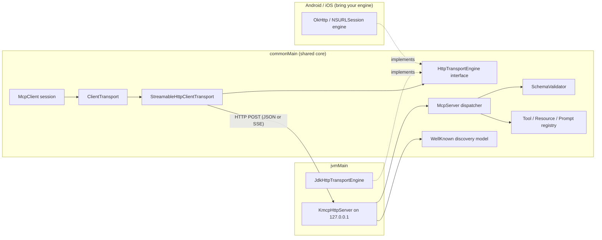

# kmcp

[English](README.md) | [中文](README.zh.md) | [日本語](README.ja.md)

 [](LICENSE) [](CHANGELOG.md) [](https://kotlinlang.org) [](https://github.com/JaydenCJ/kmcp/issues)

**Kotlin Multiplatform 的开源 MCP client/server SDK——协议核心全部位于 `commonMain`，已在 JVM 上验证。**


```bash
git clone https://github.com/JaydenCJ/kmcp.git && cd kmcp && ./gradlew publishToMavenLocal
```

## 为什么是 kmcp？

MCP 已经成为 agent 与应用之间事实上的互操作层，但一等公民 SDK 只覆盖 TypeScript 和 Python——Kotlin 与 Android 开发者只能手写 JSON-RPC 胶水代码。kmcp 在 `commonMain` 中原生实现当前世代的 MCP：无状态 Streamable HTTP transport、协议版本协商、带 JSON Schema 校验的工具注册 DSL，以及 `/.well-known/mcp` 发现文档模型（属草案约定，见「特性」）。协议核心是平台中立的 Kotlin；当前经过构建与测试的路径是 JVM artifact——Android 应用同样使用它——已声明的 iOS target 还需要在 macOS 主机上编译。

|  | kmcp | Official SDKs (TypeScript / Python) | koog |
|---|---|---|---|
| 定位 | MCP protocol SDK (client + server) | MCP protocol SDK (client + server) | Agent framework built on top of MCP |
| Kotlin Multiplatform | JVM (built + tested); iOS targets declared, not yet compiled; Android via the JVM artifact | no (TypeScript / Python runtimes) | Kotlin, JVM-first |
| 无状态 Streamable HTTP client transport | yes, in `commonMain` | yes | consumes MCP through clients |
| `.well-known/mcp` 发现文档模型（草案约定） | draft model + parser + served by the JVM host | no built-in model | no |
| 工具入参校验 | JSON Schema subset validator built in | via zod / pydantic | delegated to the protocol layer |

## 特性

- **一套协议核心，全部在 `commonMain`** —— JSON-RPC 2.0 消息模型、initialize 握手、tools/resources/prompts 都是平台中立的 Kotlin，各 target 共享同一实现。当前验证程度并不均等：JVM target 已构建并通过测试；已声明的 iOS target 只能在 macOS 主机上编译、尚未构建过；Android 使用 JVM artifact。
- **为无状态而生** —— 面向 MCP 的无状态 Streamable HTTP 世代设计：每个请求都是自包含的往返，服务端无会话亲和性，天然支持水平扩展。
- **自带校验的工具 DSL** —— 用类型化 DSL 声明一次入参，kmcp 自动生成 JSON Schema，非法调用在进入 handler 之前就以 `-32602` 错误拒绝。
- **内置发现机制（草案）** —— `.well-known/mcp` 文档模型与解析器，内置 JVM host 自动对外提供该文档。该文档形状遵循生态中流通的发现草案，并非已发布 MCP 规范的一部分，后续可能变化。
- **可插拔 HTTP 引擎** —— JVM 自带 `java.net.http` 引擎；Android 用 OkHttp、iOS 用 NSURLSession，各自只需实现一个小接口。
- **零依赖 JVM server host** —— 基于 `com.sun.net.httpserver` 内嵌 MCP 端点，默认只绑定 `127.0.0.1`。

## 快速开始

1. 构建并安装到本地 Maven 仓库：

```bash
git clone https://github.com/JaydenCJ/kmcp.git && cd kmcp && ./gradlew publishToMavenLocal
```

2. 在你的项目中添加依赖：

```kotlin
repositories { mavenLocal(); mavenCentral() }
dependencies { implementation("dev.kmcp:kmcp:0.1.0") }
```

3. 定义 server、连上 client、调用工具——这段代码被 `ReadmeExampleTest` 原样覆盖：

```kotlin
val server = mcpServer(name = "echo", version = "0.1.0") {
    tool("echo", description = "Echo text back") {
        input { string("text", description = "Text to echo") }
        handle { args -> toolText("echo: " + args.string("text")) }
    }
}
val client = McpClient(InMemoryTransport(server), Implementation("demo", "0.1.0"))
client.initialize()
val result = client.callTool("echo", buildJsonObject { put("text", "hi") })
println(result.text()) // echo: hi
```

输出：

```text
echo: hi
```

4. 让同一个工具跑在真实 HTTP 上（先 `./gradlew runEchoServer`，再开另一个终端）：

```bash
curl -s http://127.0.0.1:8931/mcp -H 'content-type: application/json' \
  -d '{"jsonrpc":"2.0","id":1,"method":"tools/call","params":{"name":"echo","arguments":{"text":"hello kmcp"}}}'
```

输出：

```text
{"jsonrpc":"2.0","id":1,"result":{"content":[{"type":"text","text":"echo: hello kmcp"}]}}
```

5. 接入 Claude Code（或任意 MCP client）——`.mcp.json`：

```json
{
  "mcpServers": {
    "kmcp-echo": {
      "type": "http",
      "url": "http://127.0.0.1:8931/mcp"
    }
  }
}
```

## 架构



[`samples/android-capabilities/`](samples/android-capabilities/) 中的 Android 参考示例演示了如何把设备能力（通讯录、日历、通知）经权限确认后暴露为 MCP tools；该示例仅提供源码，详见其自带的 README。

## 开发

在 Linux、macOS 或 Windows 上装好 JDK 11+ 即可运行全部验证（测试跑在 JVM target 上）：

```bash
./gradlew jvmTest      # unit + integration tests (77 tests)
bash scripts/smoke.sh  # offline MCP protocol round-trip smoke test
./gradlew build        # full build; Apple targets are skipped automatically on non-macOS hosts
```

最近一次本地实跑：`./gradlew jvmTest` 共 77 个测试 `PASSED`、0 个 `FAILED`；`bash scripts/smoke.sh` 以 `SMOKE OK` 结束。

## 路线图

- [x] `commonMain` 中的 MCP 核心：JSON-RPC 2.0 消息模型、带版本协商的 initialize 握手、tools/resources/prompts、无状态 Streamable HTTP client transport、JSON Schema 校验、`.well-known/mcp` 发现文档模型
- [ ] JVM server host 支持 SSE 流式响应
- [ ] 开箱即用的 OkHttp（Android）与 NSURLSession（iOS）引擎构件
- [ ] 面向本地进程 server 的 stdio transport
- [ ] 发布到 Maven Central

完整列表见 [open issues](https://github.com/JaydenCJ/kmcp/issues)。

## 参与贡献

欢迎贡献——从 [good first issue](https://github.com/JaydenCJ/kmcp/issues?q=is%3Aissue+is%3Aopen+label%3A%22good+first+issue%22) 入手，或提交 [issue](https://github.com/JaydenCJ/kmcp/issues) 参与讨论。另见 [CONTRIBUTING.md](CONTRIBUTING.md)。

## 许可证

[MIT](LICENSE)
